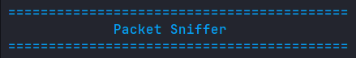
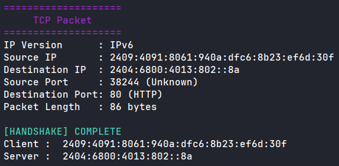
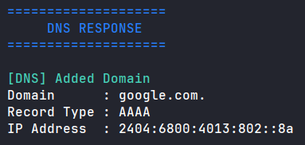
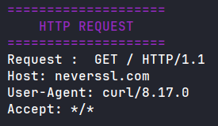
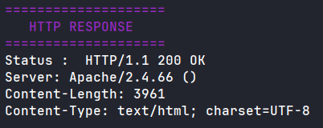
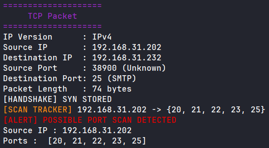
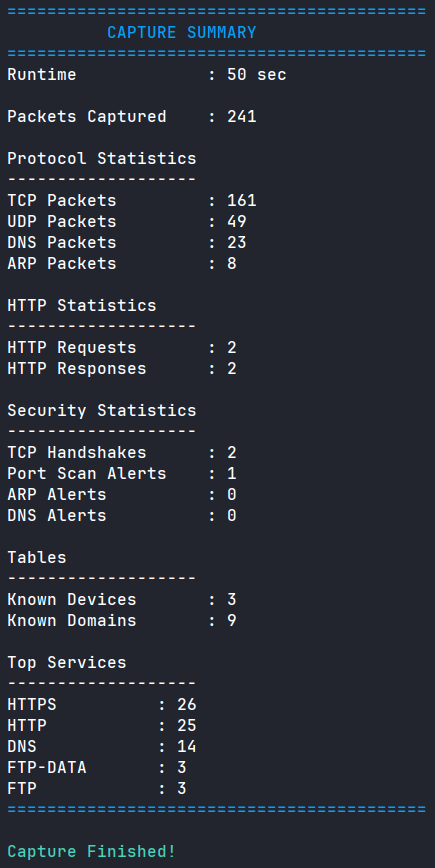
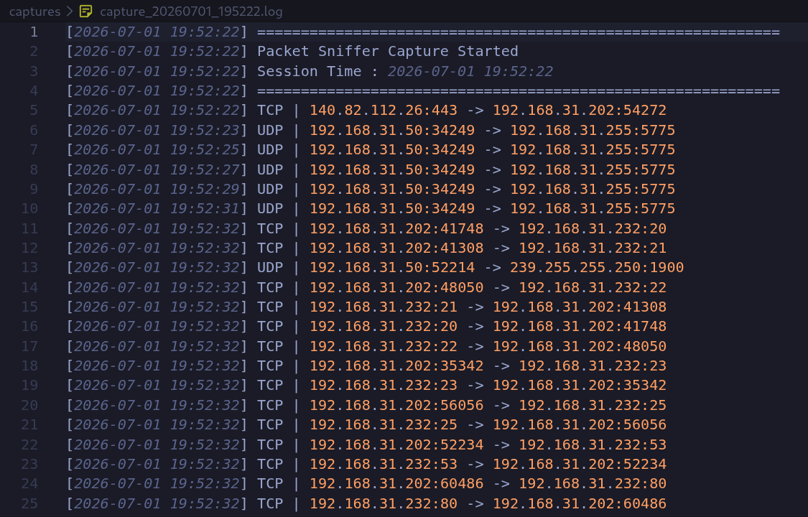
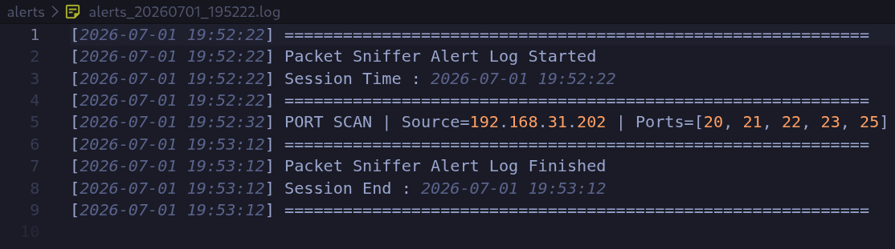

# Packet Sniffer with IDS Features

A Python-based packet sniffer built using **Scapy** that captures and analyzes live network traffic 
while performing real-time intrusion detection. The application supports protocol analysis for **TCP, 
UDP, DNS, HTTP, ARP, IPv4, and IPv6**, while implementing multiple security detection techniques such 
as **TCP Handshake Detection, Port Scan Detection, ARP Spoofing Detection, and DNS Poisoning 
Detection**.

This project was developed as a hands-on exploration of computer networking, packet analysis, and 
intrusion detection concepts using Python. In addition to live packet capture, the application 
generates timestamped capture logs, alert logs, protocol statistics, and a session summary to provide a 
comprehensive view of network activity.

## Tech Stack

- **Language:** Python 3
- **Packet Library:** Scapy 2.7.1
- **Networking:** Raw Packet Capture
- **Protocols Supported:** TCP, UDP, DNS, HTTP, ARP, IPv4, IPv6
- **Logging:** Timestamped Capture & Alert Logs
- **Terminal Output:** ANSI Escape Colors

## Features

### Packet Analysis

- Live packet capture using Scapy
- IPv4 and IPv6 packet support
- TCP and UDP packet analysis
- DNS query and response analysis
- HTTP request and response parsing
- ARP packet inspection

### Intrusion Detection

- TCP Three-Way Handshake Detection
- Port Scan Detection using SYN packet analysis
- ARP Spoofing Detection through IP-to-MAC verification
- DNS Poisoning Detection using stored DNS records

### Monitoring & Logging

- Timestamped packet logging
- Separate Capture and Alert log files
- Runtime protocol statistics
- Top Services summary
- Session summary upon termination

### User Interface

- Color-coded terminal output using ANSI escape sequences
- Clean packet formatting
- Graceful shutdown using `Ctrl + C`

## Detection Techniques

### TCP Three-Way Handshake Detection

The application tracks TCP connection states using an in-memory dictionary. A connection is recorded 
when a **SYN** packet is observed, updated when the corresponding **SYN-ACK** is received, and marked 
as complete only after the final **ACK** packet is detected. This enables the program to identify 
successful TCP connection establishment in real time.

---

### Port Scan Detection

Potential port scans are detected by monitoring outgoing **SYN** packets. For each source IP address, 
the application maintains a set of unique destination ports that have been contacted.

If the number of unique destination ports exceeds a configurable threshold during a capture session, 
the application raises a **Possible Port Scan** alert and records the event in the alert log.

---

### ARP Spoofing Detection

The application builds an internal **IP-to-MAC address table** by observing ARP Reply packets.

Whenever a known IP address advertises a different MAC address than the one previously learned, the 
application raises a **Possible ARP Spoofing** alert. The original mapping is intentionally preserved 
to prevent an attacker from replacing trusted entries.

---

### DNS Poisoning Detection

DNS responses are monitored to build a table of previously observed domain-to-IP mappings.

When a domain resolves to an IP address different from the stored record, the application raises a 
**Possible DNS Poisoning** alert.

> **Note:** Modern services often use DNS load balancing and Content Delivery Networks (CDNs), which 
may legitimately return different IP addresses for the same domain. As a result, this feature may 
occasionally generate false positives.

---

### HTTP Traffic Analysis

For unencrypted HTTP traffic (port 80), the application extracts useful information from captured 
packets, including:

- HTTP Requests
  - Request Method
  - Requested Resource
  - HTTP Version
  - Host Header

- HTTP Responses
  - Status Code
  - Content Type
  - Content Length
  - Server Header

HTTPS traffic is encrypted and therefore cannot be parsed without TLS decryption.


## Project Structure

```text
packet_sniffer/
│
├── alerts/
│   └── alert_YYYYMMDD_HHMMSS.log
│
├── captures/
│   └── capture_YYYYMMDD_HHMMSS.log
│
├── screenshots/
│
├── sniffer.py
├── requirements.txt
├── LICENSE
├── .gitignore
└── README.md
```

- **alerts/** – Stores timestamped alert logs generated during each capture session.
- **captures/** – Stores timestamped packet capture logs.
- **screenshots/** – Images used throughout this README.
- **sniffer.py** – Main application containing packet capture, protocol analysis, IDS logic, logging, 
and statistics.


## Installation

### 1. Clone the repository

```bash
git clone https://github.com/Abhiram-Saddikuti/packet_sniffer.git
cd packet_sniffer
```

### 2. Install the required package

```bash
pip install -r requirements.txt
```

### 3. Run the application

Linux requires administrator privileges to capture packets.

```bash
sudo python3 sniffer.py
```

## Usage

Once started, the packet sniffer begins monitoring live network traffic in real time.

During execution, the application:

- Captures incoming and outgoing packets
- Identifies the packet protocol
- Displays protocol-specific information
- Tracks TCP handshakes
- Monitors potential security threats
- Generates timestamped capture and alert logs
- Maintains runtime statistics

Press **Ctrl + C** at any time to stop the capture. The application will gracefully terminate, save the 
logs, and display a session summary.

## Screenshots


### Startup

The application displays a clean startup banner before beginning packet capture.



---

### TCP Packet Analysis

The application extracts protocol information such as IP addresses, ports, packet length, and tracks 
TCP three-way handshakes.



---

### DNS Analysis

DNS packets are inspected to extract queried domains and resolved IP addresses while maintaining a 
table of observed DNS records.



---

### HTTP Traffic Analysis

For unencrypted HTTP traffic, the application extracts request and response metadata.




---

### Port Scan Detection

The application tracks unique destination ports contacted by each source IP. When the configured 
threshold is exceeded, a potential port scan alert is generated and recorded.



---

### Session Summary

When the capture session is terminated using **Ctrl + C**, the application displays a comprehensive 
summary containing runtime statistics, protocol counts, security events, and the most frequently 
observed network services.



---

### Log Files

Each capture session automatically generates timestamped capture and alert logs for future analysis.





## Known Limitations

While the application provides real-time packet analysis and intrusion detection, it has a few 
limitations:

- HTTPS payloads cannot be inspected because they are encrypted using TLS.
- DNS Poisoning Detection may produce false positives due to legitimate DNS load balancing and Content 
Delivery Networks (CDNs).
- Only the first DNS Resource Record in a response is currently analyzed.
- The application requires administrator/root privileges to capture packets.
- The application performs **live packet capture only** and does not currently support offline PCAP 
analysis.


## Future Improvements

Future versions of the project may include:

- Modular project architecture
- Offline PCAP file analysis
- Command-line arguments using `argparse`
- Configurable detection thresholds
- Support for additional protocols (ICMP, FTP, SMTP, etc.)
- Export statistics to CSV or PDF
- Graphical User Interface (GUI)
- Improved HTTP parsing
- Multi-threaded packet processing


## License

This project is licensed under the MIT License.

See the [LICENSE](LICENSE) file for more details.


## Author

**Abhiram Saddikuti**

GitHub: https://github.com/Abhiram-Saddikuti


## What I Learned

Building this project provided practical experience with:

- Packet capture using Scapy
- TCP/IP networking fundamentals
- Protocol analysis (TCP, UDP, DNS, HTTP, and ARP)
- TCP connection state tracking
- Intrusion Detection System (IDS) techniques
- Stateful protocol analysis using Python data structures
- Logging and session reporting
- Incremental software design and testing